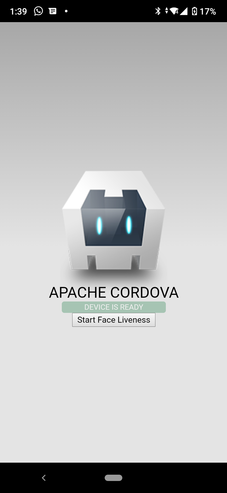
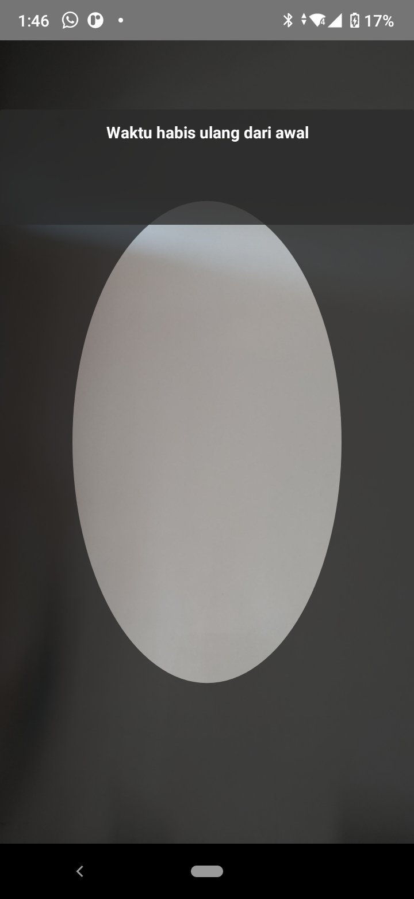

# cordova-plugin-liveness

## Notes
This plugin is using nodeflux SDK face liveness version `0.3.4`

## Platform supported

- Android

## Requirements

- [JDK](https://adoptopenjdk.net/installation.html)
- [Gradle](https://gradle.org/install/)
- [Cordova](https://cordova.apache.org/)
- [Android Studio](https://developer.android.com/studio?gclid=CjwKCAjw-qeFBhAsEiwA2G7Nly4NAfkF6Z2ct5BNm_lFwrkiv-VgWwQK4o_AHhBJ6ycus8uWRkDWKRoCUKYQAvD_BwE&gclsrc=aw.ds)

## Getting started

Initiate cordova project

```bash
$ cordova create liveness
```

Navigate to project directory and add plaform that you need.

```bash
$ cd liveness
$ cordova platform add android
```

add plugin cordova-plugin-liveness to project

```bash
$ cordova plugin add https://github.com/nodefluxio/cordova-plugin-face-liveness
```

enable androidX with add configuration to `config.xml` at parent directory

```xml
<?xml version='1.0' encoding='utf-8'?>
<widget id="io.cordova.hellocordova" version="1.0.0" xmlns="http://www.w3.org/ns/widgets" xmlns:cdv="http://cordova.apache.org/ns/1.0">
    ...
    <preference name="AndroidXEnabled" value="true" />
</widget>

```

register android activity at `platform/android/app/src/main/AndroidManifest.xml`

```xml
<?xml version='1.0' encoding='utf-8'?>
<manifest android:hardwareAccelerated="true" android:versionCode="10000" android:versionName="1.0.0" package="io.cordova.hellocordova" xmlns:android="http://schemas.android.com/apk/res/android">
    <supports-screens android:anyDensity="true" android:largeScreens="true" android:normalScreens="true" android:resizeable="true" android:smallScreens="true" android:xlargeScreens="true" />
    <uses-permission android:name="android.permission.INTERNET" />
    <application android:hardwareAccelerated="true" android:icon="@mipmap/ic_launcher" android:label="@string/app_name" android:supportsRtl="true">
        <activity android:configChanges="orientation|keyboardHidden|keyboard|screenSize|locale|smallestScreenSize|screenLayout|uiMode" android:label="@string/activity_name" android:launchMode="singleTop" android:name="MainActivity" android:theme="@android:style/Theme.DeviceDefault.NoActionBar" android:windowSoftInputMode="adjustResize">
            <intent-filter android:label="@string/launcher_name">
                <action android:name="android.intent.action.MAIN" />
                <category android:name="android.intent.category.LAUNCHER" />
            </intent-filter>
        </activity>
        <activity android:name="nodeflux.sdk.liveness.Liveness" android:theme="@style/Theme.AppCompat.Light" />  <!--  this line of code -->
    </application>
</manifest>

```

add button to `www/index.html`

```html
...
<h1>Apache Cordova</h1>
<div id="deviceready" class="blink">
    <p class="event listening">Connecting to Device</p>
    <p class="event received">Device is Ready</p>
</div>
<button id = "face-liveness-button">Start Face Liveness</button> <!--  <-- this line of code -->
...
```

add event listiner to button and function to call liveness

```javascript
document.addEventListener('deviceready', onDeviceReady, false);

function onDeviceReady() {
    // Cordova is now initialized. Have fun!

    console.log('Running cordova-' + cordova.platformId + '@' + cordova.version);
    document.getElementById('deviceready').classList.add('ready');
    document.getElementById("face-liveness-button").addEventListener("click", faceLiveness); // <-- this line of code
}

function faceLiveness() { // <-- this function
    cordova.exec(function (res) {
        console.log(res)
    }, function (err) {
        console.log(err)
    }, "FaceLiveness", "liveness", []);
}
```

after everything is done, you should be able to run cordova

```bash
$ cordova run android
```

You should able to see example app like below


